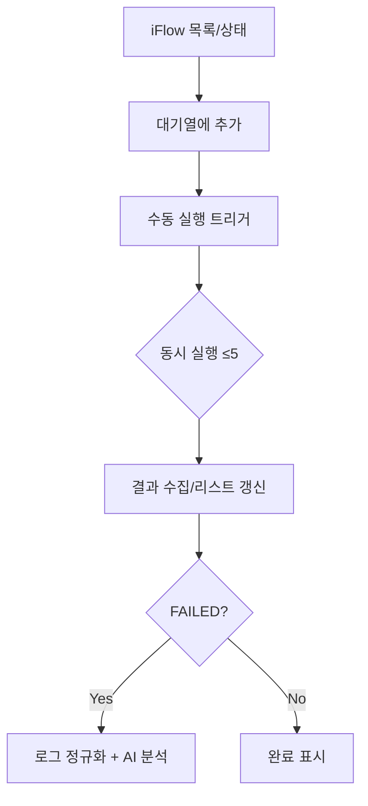

# IntegraScope
SAP Integration Suite(CPI)의 실패 로그를 자동으로 수집·정규화하고, LLM(Gemini)기반으로 원인 분석과 해결 가이드를 제공하는 운영 지원 도구입니다. 

Streamlit UI와 FastAPI 백엔드를 통해 테스트 실행 이력 조회, 실패 케이스 분석, 향후 유사 사례 재사용(벡터 검색)을 목표로 합니다.

## 핵심 가치
- **빠른 장애 대응**: MPL 실패 로그를 정규화(토닝)해 노이즈를 제거하고 바로 분석에 투입
- **행동 가능한 분석**: LangGraph + LangChain 파이프라인으로 구조화된 원인/검증/해결 JSON 생성 (한국어)
- **지식 축적**: ChromaDB 기반 유사 사례 검색으로 동일/유사 장애의 재분석 최소화(로드맵)
- **테스트-분석 연결**: 테스트 실행 결과에서 한 번에 실패 원인을 분석하는 흐름 제공(RPG 스타일 큐 기반 설계)

## 주요 기능 (PRD 기준)
- **실패 로그 수집·정규화(Toon)**: SAP IS Message Processing Log OData API로 로그를 가져와 URL 마스킹, MPL 라인 제거, 상태코드/예외 추출 등 정규화
- **AI 기반 오류 분석 및 해결 제안**  
  - LangGraph로 단계형 워크플로(로그 수집 → 분석 → 해결책 생성) 구성  
  - LangChain + Gemini LLM으로 한국어 JSON 출력(가설, 검증 단계, 추가 필요 데이터, 해결 체크리스트)
- **유사 사례 검색/지식 축적**: ChromaDB 벡터 스토어와 하이브리드 검색(계획)
- **테스트 자동화 연동(RPG 흐름)**: iFlow 리스트 → 테스트 대기열 → 수동 실행 트리거 → 병렬(최대 5개) 비동기 실행 → 실패 시 “Analyze Error” 버튼으로 분석 연계

## 아키텍처 개요
```mermaid
flowchart LR
    UI[Streamlit\napp/client] -- REST --> API[FastAPI\napp/server]
    API -- OAuth2 --> SAP[SAP IS APIs\n(MPL, Error Info, Test)]
    API -- Normalize --> Toon[ErrorLogRegulation\n(status, exception, masked log)]
    API -- LangGraph --> LLM[Gemini via LangChain]
    API -. planned .-> Chroma[ChromaDB\nvector store]
    UI <-- JSON --> API
```

테스트 자동화 설계 흐름


## 구성 요소
- **Backend (FastAPI, app/server)**
  - `/api/health`, `/api/info`
  - `/api/analysis` : message_guid 입력 → LangGraph 파이프라인 실행 → 정규화 로그 + 분석/해결 JSON 반환
  - `/api/tested` : 시간 구간/상태 필터로 테스트 실행(MPL) 목록 조회
  - `/api/packages`, `/api/artifacts` : SAP IS 패키지/아티팩트 목록 조회
  - LangGraph(`graph_runner.py`) : error_log → analysis → solution 노드 구성
  - LangChain(`chain_runner.py`) : Gemini LLM 호출, 한국어 JSON 포맷 강제
  - SAP 연동(`sap/`) : OAuth2 토큰 획득, MPL/에러 로그 조회, 로그 정규화(`ErrorLogRegulationComponent`)
- **Frontend (Streamlit, app/client)**
  - `Artifact Search` : 패키지/아티팩트 선택 후 기간별 실행 이력 조회
  - `Tested Artifacts` : 최근 실행 결과 리스트, 실패 건에서 바로 분석 페이지 이동
  - `Error Analysis` : Message GUID로 분석 호출 → 컨텍스트/분석/솔루션 표시, 원본 로그 확인
- **지식 스토어(계획)**: `Config`에 Chroma 호스트/포트 포함, 향후 분석 결과를 케이스로 적재/검색

## 데이터 흐름 (분석 요청)
1. 사용자가 UI에서 Message GUID로 `/api/analysis` 호출  
2. FastAPI가 SAP IS OAuth2 토큰 발급 → MPL 메타데이터 + 에러 로그 조회  
3. 로그 정규화(마스킹, 상태코드/예외 추출) 후 LangGraph로 전달  
4. LangChain+Gemini가 분석 JSON, 이어서 솔루션 JSON 생성(한국어, 체크리스트 중심)  
5. UI에 정규화 로그/메타데이터/분석/솔루션을 표시, 원본 로그도 함께 제공

### 분석/솔루션 출력 스키마(요약)
```json
{
  "analysis": {
    "summary": "...",
    "classification": { "category": ["HTTP", "TLS", ...], "confidence": 0.0 },
    "top_causes": [{ "hypothesis": "...", "evidence": [], "how_to_verify": [] }],
    "question_for_user": [],
    "additional_data_needed": [{ "data": "...", "reason": "...", "how": "..." }]
  },
  "solution": {
    "solutions": [{
      "fix_plan": "...",
      "check_list": [{ "target": "...", "check_points": [], "expected": "..." }],
      "prove_scenario": "...",
      "prevention": "...",
      "additional_data_needed": []
    }]
  }
}
```

## 빠른 시작
### 요구 사항
- Python 3.11+
- SAP IS API 접근용 클라이언트/시크릿, Base URL, Token URL
- Google API Key(Gemini)

### 환경 변수 (.env 예시)
```env
sap_is_base_url=https://your-tenant.it-cpitrial.../api/v1
sap_is_token_url=https://your-tenant.authentication.../oauth/token
sap_is_client_id=your_client_id
sap_is_client_secret=your_client_secret

google_api_key=your_gemini_api_key
gemini_model=gemini-1.5-pro
temperature=0.2

chroma_host=127.0.0.1
chroma_port=8000
log_level=INFO
```

### 설치 & 실행
```bash
# 1) 백엔드 의존성 설치
python -m venv .venv && source .venv/bin/activate
pip install -r app/server/requirements.txt

# 2) FastAPI 서버 실행 (기본: http://localhost:8000)
uvicorn app.server.main:app --reload --host 0.0.0.0 --port 8000

# 3) 프런트엔드 의존성 설치
pip install -r app/client/requirements.txt

# 4) Streamlit 실행 (기본: http://localhost:8501)
streamlit run app/client/run.py
```
- 프런트엔드가 호출하는 API 베이스 URL은 `app/client/api/api_client.py`의 `API_BASE_URL`을 수정해 조정할 수 있습니다.

## 디렉터리 가이드
```
app/
├── server/           # FastAPI, LangGraph/LangChain, SAP API 클라이언트
│   ├── sap/          # OAuth2, MPL/에러 로그, 오브젝트 검색
│   ├── lang_graph/   # 분석 파이프라인 그래프 정의
│   ├── lang_chain/   # Gemini 호출 및 프롬프트/파서
│   └── utils/        # 설정, 로깅, 시간 변환
└── client/           # Streamlit UI
    ├── pages/        # artifact_search, tested_list, analysis
    └── components/   # 조회/카드 컴포넌트
```

## 운영 시 고려사항
- 실제 SAP IS 테넌트에 영향을 줄 수 있으므로 테스트/운영 환경을 분리하고 최소 권한의 OAuth 클라이언트를 사용하십시오.
- LLM 응답은 입력 로그에 의존하므로, 로그 마스킹 규칙을 필요에 따라 확장해 민감정보 노출을 차단하세요.
- 테스트 자동화 큐/동시성(≤5) 및 유사 사례 적재/검색은 로드맵 항목입니다. 현 버전에서는 MPL 조회 및 실패 분석 흐름을 우선 제공합니다.
- 로그 수집/LLM 호출 시 네트워크 지연이 발생할 수 있으니 Streamlit 타임아웃/스피너를 활용해 사용자 경험을 유지하세요.

## 로드맵
1. **MVP 안정화**: 로그 정규화 확장, 분석 프롬프트 버저닝, 에러 핸들링 개선
2. **지식 재사용**: ChromaDB 적재/검색 파이프라인 연결, 유사 사례 결과를 분석 단계에 통합
3. **테스트 자동화 고도화**: 대기열/동시 실행 제어, 실행 이력 대시보드, 실패→분석 자동 링크 강화
4. **운영 편의**: API 키/엔드포인트 설정 UI, 다국어/역할 기반 접근 제어
